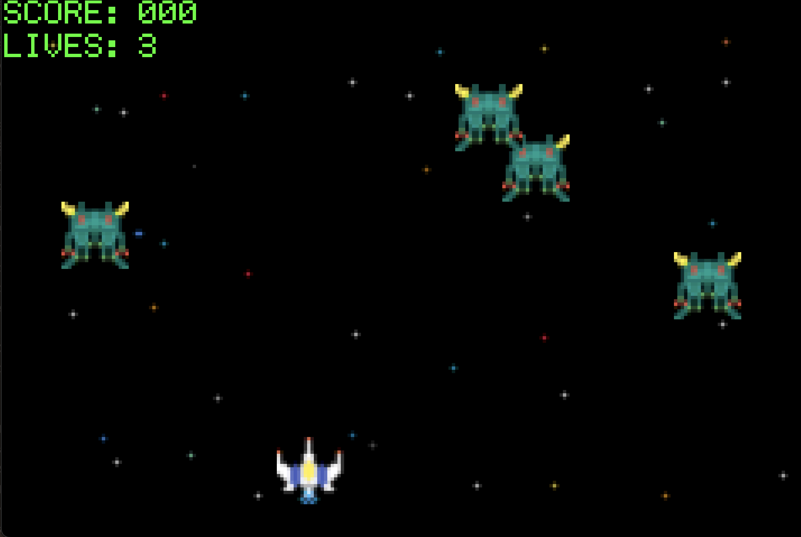
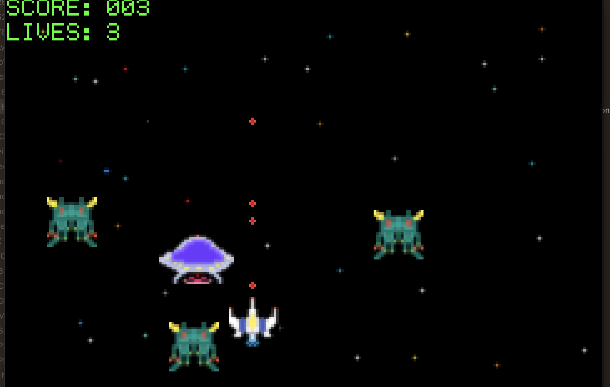

# GBAgame
Space invaders inspired game

Made this in C for a class at GT. 

Main challneges with this project:
 - dealing with drawing the image to the screen efficiently and preventing ripping
 - Dealing with objects
 - Collision detection
 - Making the game fun

Download Shoota.gba and play on a GBA emulator like OpenEmu!

Here is some of the pixel art for the game

